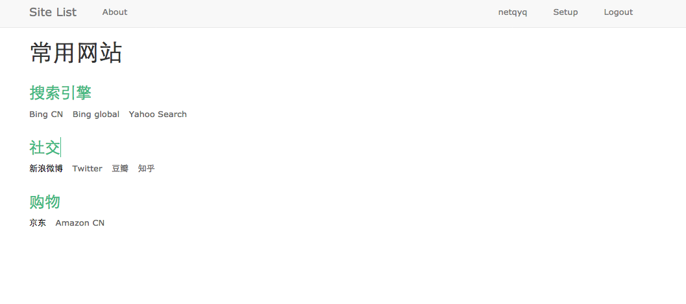
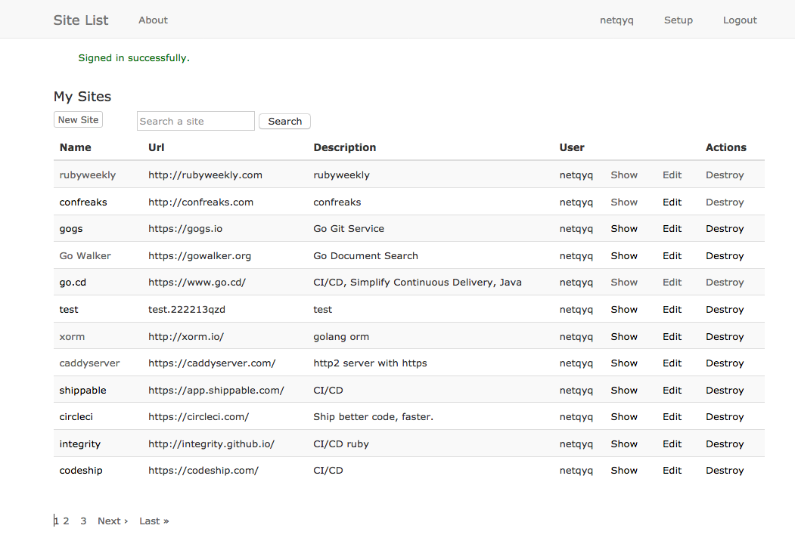

# Site List
Site List 具有常用网站导航功能和个人网站收藏功能。


* Ruby version
```
Ruby 2.3.1
Rails 5.0.0.1
```
* 主要功能特性
```
常用网站导航主页
个人网站收藏（按用户）
个人网站搜索
分页
登陆注册

```


* 主要用到的Gems
```
devise
sunspot_rails
kaminari
cancan
rucaptcha
```
* Configuration
```

mv config/secrets.default.yml config/secrets.yml
使用rake secret命令生成key填入secrets.yml或者使用环境变量

mv config/database.default.yml config/database.yml

```

* Database creation
```
后台数据库为PostgreSQL
rake db:create
rake db:migrate
```

* Demo
首页导航

个人站点收藏



